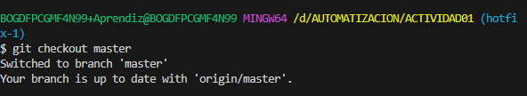
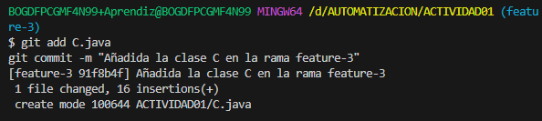
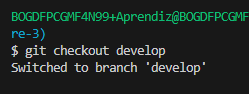
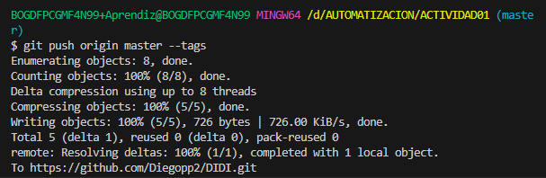

<!DOCTYPE html>
<html lang="es">
<head>
    <meta charset="UTF-8">
    <meta name="viewport" content="width=device-width, initial-scale=1.0">
    <title>Manual del Proyecto</title>
    
</head>
<body>
    <h1>Manual del Proyecto</h1>
    

# ✅ DIEGO POVEDA
- [💻 ABOUT THE PROJECT](#about-projects)
- [🛠️BUILD WITH](#built-with)    
-[]
-[]

   
    

        

            
        

        

            <h2>Ejercicio 2: Creación de la rama develop a partir de main </h2>
            

                Descripción detallada del paso 2.
            

            

        

            
        

        

    

    

        

            
        

        

            <h2>Ejercicio 3: Creación de la rama feature-1 y añadir la clase A con los atributos: foo bar </h2>
            

                Descripción detallada del paso 3.
                 

        

            
        

        

        

            
        

        

        

            
        

            

        

    

    

        

            
        

        

            <h2>Ejercicio 4: Mergear feature-1 con develop</h2>
            

                Descripción detallada del paso 4.
                

        

            
        

         

        

            
        

         

        

            
        

        

        

            
        

        
    

    

        

            
        

        

            <h2>Ejercicio 5: Mergear develop con main y generar la etiqueta v1.0</h2>
            

                Descripción detallada del paso 5.
            

            

        

            
            

        

            
            

        

            
            

        

            
            

        

            
            

        

            
        

        

    

    

        

            
        

        

            <h2>Ejercicio 6:
            Creación de la rama feature-2 y añadir la clase B. </h2>
            

                Descripción detallada del paso 5.
                

        

            
        

        

        

            
        

        

        

            
        

            

        

    

    

    

        

            
        

        

            <h2>Ejercicio 8: Mergear feature-2 con develop </h2>
            

                Descripción detallada del paso 8.
            

            

        

            
        

        

        

            
        

        

    

    

        

            
        

        

            <h2>Ejercicio 9: Mergear feature-3 con develop </h2>
            

                Descripción detallada del paso 8.
            

            

        

            
        

        

        

            
        

        

        

            
        

        

    

    

        

            
        

        

            <h2>Ejercicio 10: Mergear develop con main y creación de la etiqueta v2.0LS </h2>
            

                Descripción detallada del paso 9.
            

             

        

            
        

         

        

            
        

        

    

    

        

            
        

        

            <h2>Ejercicio 11: Creación de rama hotfix-1 a partir de main y añadir un atributo lorem en clase A </h2>
            

                Descripción detallada del paso 10.
            

             

        

            
        

         

        

            
        

         

        

            
        

        

    

    

        

            
        

        

            <h2>Ejercicio 12: Mergear rama hotfix-1 con main y creación de etiqueta v2.1 </h2>
            

                Descripción detallada del paso 11.
            

             

        

            
        

         

        

            
        

         

        

            
        

        

    

 

            
        

        

            <h2>Ejercicio 12: Mergear rama hotfix-1 con main y creación de etiqueta v2.1 </h2>
            

                Descripción detallada del paso 12.
            

             

        

            
        

         

        

            
        

         

        

            
        

         

        

            
        

        

    

</body>
</html>
